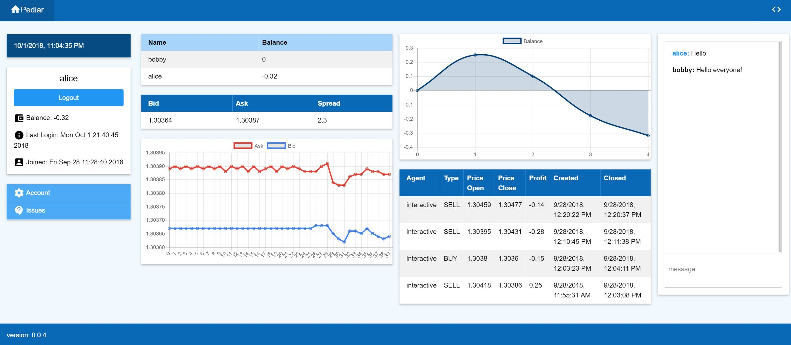

# ASA - Algo Soc Agent

### [algo soc](http://www.algosoc.com)

### [algo soc slack](https://algosoc.slack.com)

## Pedlar:

### [pedlar server](http://icats.doc.ic.ac.uk) 

(Requires access to Imperial Wifi Network)




## RL Agent Notes and Setup

#### How to show the performance of the model

```bash
$ bokeh serve --show performance
$ python agent.py
```

### General To-Do

|Item #| Description                                                        | Done|
|:---: | :---------------------------------------------------------------   |:---:|
|1     | Improve documentation and comments for functions                   |     |
|2     | Make bokeh visualisation scalable                                  |     |
|3     | Bokeh button for starting and ending backtest                      |     |


### RL To-Do

|Item #| Description                                                        | Done|
|:---: | :---------------------------------------------------------------   |:---:|
|1     | Normalise inputs and outputs to neural network                     |     |
|2     | Add lstm input to network                                          | Yes |
|3     | Add sharpe ratio as the models reward                              |     |
|4     | Integrate Advantage Model                                          |     |
|5     | Integrate Critic Model                                             |     |
|6     | Add multiple training agents                                       |     |
|7     | Train on exit with random entry (learn to exit)                    | WIP |
|8     | Train on a batch of trades (learn to maximise over several trades) |     |
|9     | Train with different market data                                   |     |
|10    | Refactor code into simpler classes                                 | Yes |
|11    | Fix bug with first few ticks of visualisation missing              |     |
|12    | Move verbose to constants                                          | Yes |
|13    | Move state, action to inside DQ                                    | Yes |


### You can contact us at: <algo.trade@imperial.ac.uk>

